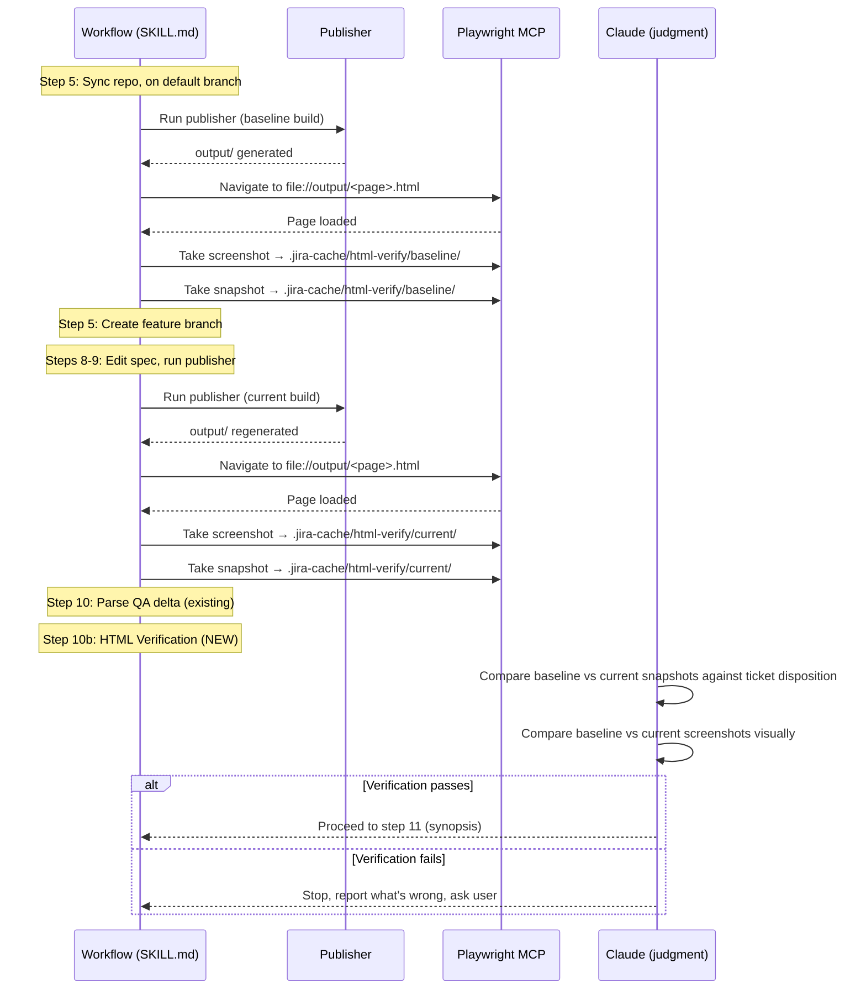

# feat: Add Playwright-based HTML verification to FHIR JIRA workflow

## Summary

Adds a new verification step to the FHIR JIRA workflow that uses Playwright MCP tools to render the publisher's HTML output, capture before/after screenshots and accessibility snapshots, and have Claude judge whether the rendered result matches the JIRA ticket's disposition. This gates the commit alongside the existing QA delta check, closing the gap between "publisher succeeded with no regressions" and "the change actually appears correctly in the published output."

---

## Problem Frame

The current workflow verifies publisher output quantitatively — `parse_qa.py` checks that error/warning counts haven't regressed. But it never verifies the *content* of the rendered HTML. A ticket might say "update the description of Observation.status" and the publisher might exit cleanly, yet the rendered page could still show the old text due to editing the wrong source file, a publisher caching issue, or a build-system quirk. Today, this class of error is only caught by human review after a PR is opened. Adding a machine-assisted content and visual check before commit catches these errors earlier in the loop.

---

## Requirements

- R1. After the publisher runs, Claude navigates to the relevant HTML page(s) in the publisher output and verifies the intended change is visible
- R2. Before/after screenshots are captured and compared visually by Claude using its vision capability
- R3. Before/after accessibility snapshots are captured for structured content comparison against the JIRA ticket disposition
- R4. Verification gates the commit — a failed check prevents proceeding to synopsis/commit, like QA regression does today
- R5. Works across all three repo types (FHIR Core/Gradle, Extensions Pack/IG Publisher, IGs/IG Publisher) despite different output directory structures
- R6. Baseline (before) state is captured from the default branch's publisher output before edits are made
- R7. Verification artifacts (screenshots, snapshots, verdict) are stored in `.jira-cache/` inside the target repo
- R8. The verification step is documented in SKILL.md as a workflow procedure step, not as a standalone tool

---

## Scope Boundaries

- No automated pixel-diff tooling — Claude's vision capability handles visual comparison
- No CI integration — this runs locally as part of the interactive workflow
- No new npm/Python dependencies for Playwright — uses the already-installed Playwright MCP plugin
- No changes to `parse_qa.py` or the existing QA delta gate — this is an additional, independent check

### Deferred to Follow-Up Work

- Attaching verification screenshots to PR bodies: separate enhancement after core verification works
- Verification for batch workflow (`/fhir-jira-batch`): add after single-ticket flow is stable
- Persistent visual regression baselines across sessions: currently baselines are per-session

---

## Context & Research

### Relevant Code and Patterns

- `SKILL.md` steps 9-11: the publisher run → QA delta → synopsis sequence where verification inserts
- `parse_qa.py`: the baseline/delta/gate pattern to mirror — captures baseline from default branch, computes delta, exits non-zero on regression
- `.jira-cache/` directory: per-repo artifact storage for ticket JSON, QA baseline, QA delta — new verification artifacts go here
- `resolve_repo.py` output: provides `qa_path`, `build_dirs`, `local_path`, and crucially the publisher output location
- `references/fhir-authoring.md`: documents output directory structures — `output/` for IGs/Extensions Pack, varies for FHIR Core Gradle build

### Institutional Learnings

- No existing learnings on HTML verification or Playwright integration (greenfield area)

### External References

- Playwright MCP plugin: provides `browser_navigate` (supports `file://` URLs), `browser_take_screenshot` (saves to custom filename), `browser_snapshot` (accessibility tree as structured text)

---

## Key Technical Decisions

1. **Playwright MCP tools in SKILL.md, not a Python script**: The verification step is a procedure in SKILL.md that instructs Claude to use Playwright MCP tools directly. Unlike the existing Python helper scripts (which are standalone CLI tools), the Playwright interaction requires Claude's judgment to interpret results — there's no deterministic pass/fail algorithm. A Python script would only handle file management, which SKILL.md instructions already handle for `.jira-cache/`.

2. **Baseline captured during existing QA baseline step**: The workflow already captures `qa-baseline.json` from the default branch before edits (SKILL.md step 10 note). The HTML baseline capture piggybacks on this same moment — after building on the default branch but before switching to the feature branch. This avoids a separate baseline publisher run.

3. **Page targeting via ticket's Related URL field**: The ticket's `Related URL` field already points to the published page that the change affects (e.g., `https://hl7.org/fhir/observation.html`). Map this URL to the local publisher output path (e.g., `output/observation.html` or the FHIR Core equivalent). This is focused and fast — typically 1-3 pages per ticket.

4. **Dual verification: accessibility snapshot + visual screenshot**: The accessibility snapshot (`browser_snapshot`) provides structured text for Claude to compare against the JIRA disposition ("does the new description text appear?"). The screenshot (`browser_take_screenshot`) catches visual regressions the text check might miss (layout breaks, missing images, rendering artifacts). Both are needed for comprehensive verification.

5. **Verdict is Claude's judgment, not a script exit code**: Unlike `parse_qa.py` which computes a deterministic `regressed: bool`, HTML verification requires Claude to interpret whether the rendered output matches the ticket's intent. The "gate" is Claude's own assessment — if verification fails, Claude stops and reports what's wrong before proceeding to synopsis.

6. **Screenshots stored in `.jira-cache/html-verify/`**: Follows the existing `.jira-cache/` convention. Subdirectory keeps verification artifacts organized: `baseline/`, `current/`, and `verdict.md` (Claude's written assessment).

---

## Open Questions

### Resolved During Planning

- **How to map Related URL to local file path**: Strip the domain and map to `output/<path>.html`. For FHIR Core where the output directory varies, use the same `find` fallback pattern already documented in SKILL.md step 10 for finding `qa.json`.
- **What if the ticket has no Related URL**: Fall back to pages implied by the edited source files. For FHIR Core, `source/observation/...` maps to `output/observation.html`. For IGs, `input/pagecontent/foo.md` maps to `output/foo.html`. If no mapping is possible, skip verification with a warning rather than blocking.

### Deferred to Implementation

- **Exact scroll/viewport behavior for full-page screenshots**: May need `fullPage: true` or targeted element screenshots depending on page length. Tune during implementation.
- **FHIR Core Gradle output path mapping**: The Gradle build's output directory structure may differ from IG Publisher's `output/`. Will need runtime discovery similar to the existing `qa.json` find pattern.
- **How many pages to verify when a ticket touches multiple resources**: Start with Related URL pages only; expand if verification misses are common.

---

## High-Level Technical Design

> *This illustrates the intended approach and is directional guidance for review, not implementation specification. The implementing agent should treat it as context, not code to reproduce.*

---

## Implementation Units

### U1. Add baseline HTML capture to the workflow

**Goal:** Capture screenshots and accessibility snapshots of the relevant published page(s) from the default branch build, before any edits are made.

**Requirements:** R2, R3, R5, R6, R7

**Dependencies:** None

**Files:**
- Modify: `plugins/fhir-jira/skills/fhir-jira-workflow/SKILL.md`

**Approach:**
- Insert instructions after the existing QA baseline capture (which already runs the publisher on the default branch) but before branching to the feature branch
- Map the ticket's `Related URL` to a local `file://` path under the publisher's output directory
- Use `browser_navigate` to open the page, `browser_take_screenshot` with `fullPage: true` and `filename` targeting `.jira-cache/html-verify/baseline/<page-name>.png`, then `browser_snapshot` with `filename` targeting `.jira-cache/html-verify/baseline/<page-name>.md`
- Document the URL-to-local-path mapping logic for each repo type (IG Publisher: `output/<path>.html`; FHIR Core Gradle: discovered via find pattern)
- Handle the "no Related URL" fallback: derive page names from edited source file paths

**Patterns to follow:**
- The existing QA baseline capture pattern in SKILL.md step 10 (snapshot from default branch before edits)
- The `.jira-cache/` artifact storage convention

**Test scenarios:**
- Test expectation: none -- this unit modifies SKILL.md procedure text only (no executable code)

**Verification:**
- SKILL.md contains clear instructions for baseline HTML capture that cover all three repo types
- The instructions specify the `.jira-cache/html-verify/baseline/` output path
- The URL-to-local-path mapping is documented for FHIR Core (Gradle) and IG Publisher repos

---

### U2. Add current-branch HTML capture after publisher run

**Goal:** After the publisher runs on the feature branch (existing step 9), capture screenshots and snapshots of the same page(s) that were baselined in U1.

**Requirements:** R1, R2, R3, R5, R7

**Dependencies:** U1

**Files:**
- Modify: `plugins/fhir-jira/skills/fhir-jira-workflow/SKILL.md`

**Approach:**
- Insert instructions after the existing publisher run (step 9) and QA delta parse (step 10)
- Navigate to the same page(s) captured in the baseline step, using the same URL-to-local-path mapping
- Save to `.jira-cache/html-verify/current/<page-name>.png` and `.jira-cache/html-verify/current/<page-name>.md`
- If multiple pages were baselined, capture all of them in the same order

**Patterns to follow:**
- Mirror the baseline capture instructions from U1 for consistency
- The existing step 10 QA delta pattern (current vs baseline comparison)

**Test scenarios:**
- Test expectation: none -- this unit modifies SKILL.md procedure text only (no executable code)

**Verification:**
- SKILL.md contains instructions for current-branch capture that mirror the baseline capture
- The instructions specify the `.jira-cache/html-verify/current/` output path
- Both baseline and current captures target the same page(s) for valid comparison

---

### U3. Add the verification judgment step

**Goal:** Add the step where Claude compares baseline vs current captures against the JIRA ticket disposition, judges pass/fail, and either proceeds or stops.

**Requirements:** R1, R2, R3, R4, R8

**Dependencies:** U1, U2

**Files:**
- Modify: `plugins/fhir-jira/skills/fhir-jira-workflow/SKILL.md`

**Approach:**
- Insert as a new step 10b (between current QA delta parse and synopsis generation)
- Claude reads the baseline and current accessibility snapshots (`.md` files) and compares the text content against the ticket's `Resolution Description` and `fields` — does the intended change appear?
- Claude views the baseline and current screenshots side-by-side and checks for visual regressions (layout breaks, missing content, rendering issues)
- Document the judgment criteria: (a) the specific change requested by the ticket is visible in the current output, (b) no unintended visual regressions are introduced, (c) the page renders correctly (no broken layouts, missing sections)
- If verification fails: stop, write a brief assessment to `.jira-cache/html-verify/verdict.md`, surface the specific issues to the user, and ask whether to fix and re-run or override
- If verification passes: note it in `.jira-cache/html-verify/verdict.md` and proceed to synopsis
- The verdict is Claude's judgment, not a deterministic check — document this explicitly so the workflow makes the non-deterministic nature clear

**Patterns to follow:**
- The existing QA delta gate pattern: "If errors increased: stop, surface the new errors, fix them, re-run the publisher. Do not proceed to commit until error count is <= baseline."
- The existing step 7 confirmation pattern for non-trivial decisions

**Test scenarios:**
- Test expectation: none -- this unit modifies SKILL.md procedure text only (no executable code)

**Verification:**
- SKILL.md contains a clear verification step with judgment criteria
- The step explicitly gates the commit — no proceeding to synopsis on failure
- The verdict is written to `.jira-cache/html-verify/verdict.md`
- The user can override a failed verification (the gate is advisory, not absolute)

---

### U4. Add URL-to-local-path mapping reference

**Goal:** Document the mapping from published URLs (hl7.org, build.fhir.org) to local publisher output paths for each repo type, so the verification step can reliably find the right HTML file.

**Requirements:** R5

**Dependencies:** None (can be done in parallel with U1)

**Files:**
- Modify: `plugins/fhir-jira/skills/fhir-jira-workflow/references/fhir-authoring.md`

**Approach:**
- Add a new section "Published URL to local output path mapping" to `fhir-authoring.md`
- Document the mapping for each repo type:
  - **IG Publisher repos** (Extensions Pack, IGs): `https://hl7.org/fhir/<ig-path>/<page>.html` → `output/<page>.html`; `https://build.fhir.org/ig/HL7/<repo>/<page>.html` → `output/<page>.html`
  - **FHIR Core** (Gradle): `https://hl7.org/fhir/<page>.html` → discovered via `find . -name '<page>.html' -path '*/output/*' -newer .git/HEAD` (Gradle output location varies)
- Include the source-file-to-output-page mapping as a fallback when no Related URL exists:
  - FHIR Core: `source/<resource>/...` → `output/<resource>.html` (or discovered)
  - IGs: `input/pagecontent/<page>.md` → `output/<page>.html`
  - Extensions Pack: `input/fsh/<ext>.fsh` → `output/StructureDefinition-<ext>.html`

**Patterns to follow:**
- The existing reference documentation style in `fhir-authoring.md` (tables, code examples, per-repo-type sections)

**Test scenarios:**
- Test expectation: none -- this unit modifies reference documentation only

**Verification:**
- `fhir-authoring.md` contains a URL mapping section covering all three repo types
- Both URL-to-output and source-file-to-output mappings are documented
- The Gradle output discovery pattern is documented with the `find` fallback

---

### U5. Update workflow step numbering and cross-references

**Goal:** Integrate the new verification steps cleanly into SKILL.md's numbering and ensure all cross-references remain correct.

**Requirements:** R8

**Dependencies:** U1, U2, U3

**Files:**
- Modify: `plugins/fhir-jira/skills/fhir-jira-workflow/SKILL.md`

**Approach:**
- The new steps insert between existing steps 10 and 11. Options: renumber all subsequent steps (11→12, 12→13, etc.) or use sub-numbering (10a: QA delta, 10b: HTML baseline capture happens earlier but is referenced here, 10c: HTML verification). Choose whichever preserves clarity — likely renumbering since the baseline capture happens at step 5 time, making sub-numbering awkward
- Update the batch procedure (B5) to note that HTML verification is deferred to follow-up work
- Ensure the "Things to never do" section doesn't conflict with new verification artifacts
- Update any internal step references (e.g., "step 11" references in other steps)

**Patterns to follow:**
- The existing SKILL.md step numbering and cross-reference style

**Test scenarios:**
- Test expectation: none -- this unit modifies SKILL.md procedure text only

**Verification:**
- All step numbers are sequential with no gaps or duplicates
- All internal cross-references point to the correct renumbered steps
- Batch procedure notes that HTML verification is deferred
- No broken references to old step numbers remain

---

## System-Wide Impact

- **Interaction graph:** The verification step uses Playwright MCP tools (browser_navigate, browser_take_screenshot, browser_snapshot) which are external to the plugin. The MCP server must be running and the plugin enabled. If Playwright MCP is unavailable, the step should degrade gracefully (warn and skip, not block).
- **Error propagation:** Playwright failures (browser crash, MCP timeout, file:// URL not found) should not block the workflow — they should surface a warning and skip verification rather than hard-failing. The QA delta gate (existing) remains the primary automated check.
- **State lifecycle risks:** Baseline captures must happen on the default branch build, before any edits. If the user skips the baseline or the publisher output is stale, verification comparison is meaningless. The instructions must make the ordering dependency explicit.
- **Unchanged invariants:** The existing QA delta gate (`parse_qa.py`) is not modified. The existing step numbering for batch workflow is not changed (verification is deferred for batch). The Python helper scripts are not modified.

---

## Risks & Dependencies

| Risk | Mitigation |
|------|------------|
| Playwright MCP not available in user's environment | Graceful degradation: skip verification with a warning, don't block workflow |
| FHIR Core Gradle output path varies per build | Use the same `find` discovery pattern already documented for `qa.json` |
| Publisher output may be stale if user skipped a rebuild | Instructions explicitly require a fresh publisher run before capture |
| Large pages may produce very large screenshots | Use `fullPage: true` judiciously; for very long pages, consider element-targeted screenshots of the changed section |
| Claude's vision judgment may produce false positives/negatives | Verification is advisory — user can override. Document judgment criteria clearly so Claude's assessment is consistent |
| file:// URLs may behave differently across OS/browser | Playwright's Chromium handles file:// URLs consistently; document the expected URL format |

---

## Documentation / Operational Notes

- The verification step adds ~30-60 seconds to the workflow per page verified (Playwright navigation + screenshot + snapshot)
- Users need the Playwright MCP plugin installed and enabled (`playwright@claude-plugins-official` in Claude settings)
- First-time setup: no additional steps beyond having the Playwright plugin — it ships with Claude Code's official plugin marketplace

---

## Sources & References

- Related code: `plugins/fhir-jira/skills/fhir-jira-workflow/SKILL.md` (workflow to modify)
- Related code: `plugins/fhir-jira/skills/fhir-jira-workflow/scripts/parse_qa.py` (gate pattern to mirror)
- Related code: `plugins/fhir-jira/skills/fhir-jira-workflow/references/fhir-authoring.md` (output structure docs)
- External: Playwright MCP plugin (`@playwright/mcp@latest`) — `browser_navigate`, `browser_take_screenshot`, `browser_snapshot` tools
